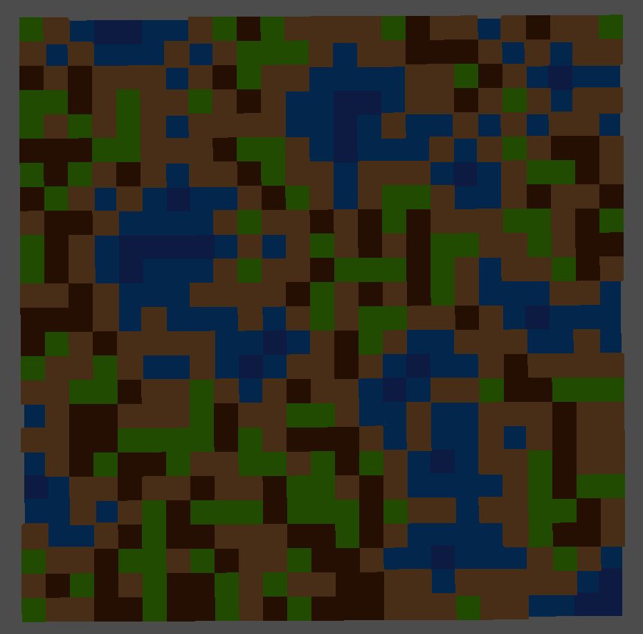

# gd-wave-function-collapse
My first project using Godot.

While all this code was handwritten, these two repositories were incredible references:
	- WaveFunctionCollapse by mxgmn: https://github.com/mxgmn/WaveFunctionCollapse
	- Even Simpler Tiled Model by Douze, implementing WFC in Godot: https://github.com/douze/estm

## Details
Create a 25x25 level of randomly generated tiles. There are currently 5 tile types:
	- All tile types can be placed next to themselves.
	- Dirt, Sand, and Grass can all be next to each other.
	- Shallow Water and Sand can be next to each other.
	- Shallow Water and Deep Water can be next to each other.

Future plans:
	- Weight logic. Right now each of the superpositions have an equal chance of being chosen, but tiles should factor in their neighbors. For example, a tile surrounding be shallow water should be weighted towards deep water.
	- Ambience. I don't know how to make a level "look" good, but I don't like the default endless gray background.
	- Verticality. The WFC algorithm I wrote _should_ work with >1 Y dimension, but I haven't tested that.
	- Smarter neighboring rules. This will probably be required to make >1 Y dimension, like how grass shouldn't be underneath another tile.

## Controls
**WASD** to move, **Space** to Jump.

**Shift** activate no-clip, use **Space** and **Control** to move up and down.

**Alt** frees the cursor from the camera. Click anywhere in the window to recapture the cursor.

**1** and **2** change the camera to first-person and third-person views.

**F** pauses generation and displays the superposition of all tiles.

**R** regenerates the level while unpaused. When paused, **R** will continue generating the level, but slower than when unpaused.
